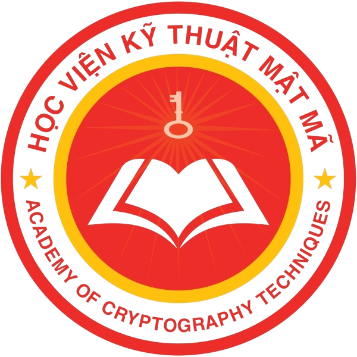
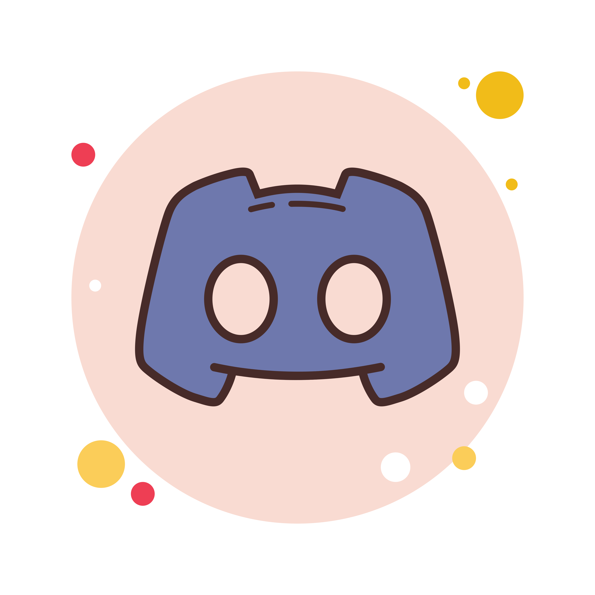

<!-- LaPhuongNam -->

  

<h1 align="center">Hi, I'm Lã Phương Nam 👋</h1>

  <b>🎓 3rd-year student at KMA (Học viện Kỹ thuật Mật mã)</b> 
  <b>💡 Passionate about technology, cybersecurity, and continuous learning</b>

---

<h2 align="center">🛠 Technologies and Tools 🛠</h2>

  
  &nbsp;
  

---

<h2 align="center">🔥 GitHub Stats 🔥</h2>

  
  

---

<h2 align="center">📫 Connect with me</h2>

  
  
  
  
  

---

<h2 align="center">📑 About Me</h2>

  Xin chào! Mình là <b>Lã Phương Nam</b>, sinh viên năm 3 tại Học viện Kỹ thuật Mật mã (KMA). Mình đam mê lĩnh vực an toàn thông tin, lập trình và luôn không ngừng học hỏi để phát triển bản thân.  
  - 🔭 Hiện tại mình đang tập trung vào các dự án học thuật, write-up CTF, và phát triển kỹ năng lập trình Python, Java. 
  - 🌱 Mục tiêu: Trở thành chuyên gia an ninh mạng, đóng góp cho cộng đồng và xây dựng các sản phẩm hữu ích. 
  - 💬 Sẵn sàng kết nối, chia sẻ và học hỏi cùng mọi người!

---

<h2 align="center">📖 Featured Projects & Activities</h2>
<ul>
  <li>🔐 <b>Write-up TryHackMe</b>: Chia sẻ kinh nghiệm, giải thích chi tiết các phòng lab về an toàn thông tin.</li>
  <li>💻 <b>Python/Java Mini Projects</b>: Xây dựng các tool nhỏ phục vụ học tập và thực tế.</li>
  <li>📝 <b>Blog cá nhân (dự kiến)</b>: Viết về các chủ đề bảo mật, lập trình, kinh nghiệm học tập tại KMA.</li>
</ul>

---

<h2 align="center">📑 My Favorite Quote 📑</h2>

<b>“Learning new everyday, not the copycat of yesterday!”</b>

---

  <i>⭐️ Cảm ơn bạn đã ghé thăm profile của mình! Nếu thấy hữu ích, hãy kết nối hoặc để lại lời nhắn nhé! ⭐️</i>

